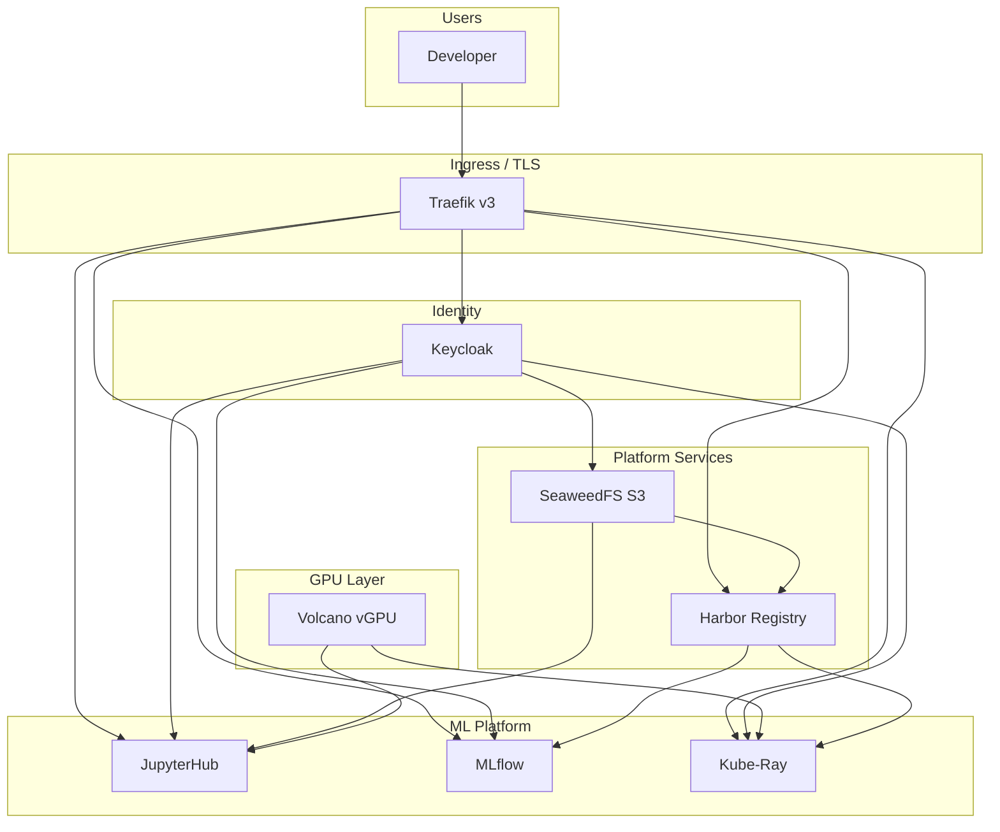
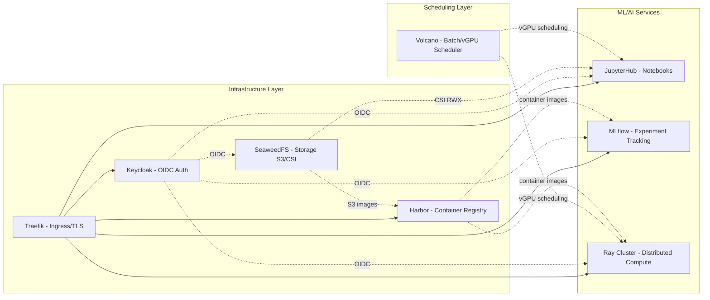

# Architecture Overview

The platform is a GPU-accelerated ML/AI environment running on a 4-node K3s Kubernetes cluster at FMFI DAI. All services share a single domain (`*.c.dai.fmph.uniba.sk`) with TLS via Let's Encrypt.

## High-Level Architecture

## Service Dependency Graph

## Key Characteristics

- **Single cluster**: 4 nodes, 1 control plane, 3 workers with specialized roles
- **Central auth**: Keycloak with `compute` realm, 6 OIDC clients, GitHub as external IdP
- **GPU sharing**: 1 NVIDIA TITAN Xp split into up to 25 virtual GPUs via Volcano/Hami
- **Distributed storage**: SeaweedFS provides both S3 API and CSI (ReadWriteMany) mounts
- **Private registry**: Harbor stores all custom and mirrored images, backed by SeaweedFS S3
