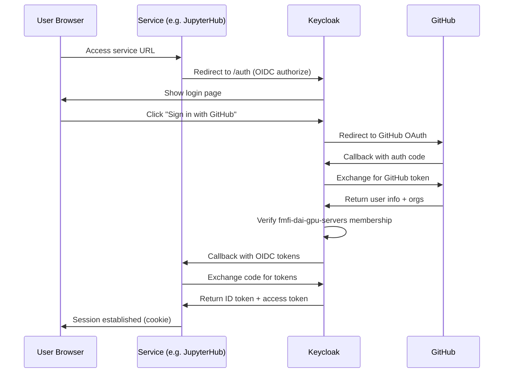
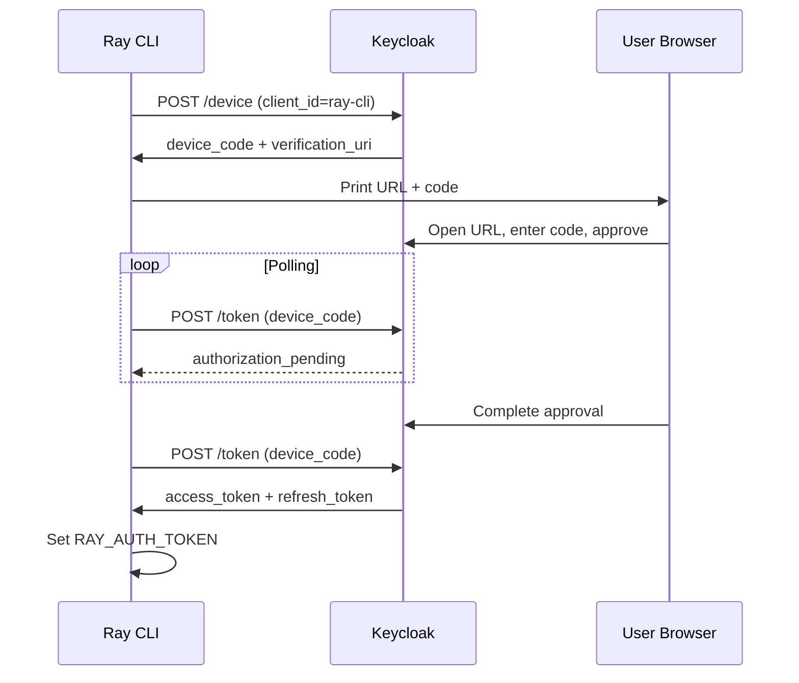

# Authentication Flow

All services authenticate through a central **Keycloak** instance using the `compute` realm. Keycloak uses **GitHub** as an external identity provider, restricting access to members of the `fmfi-dai-gpu-servers` GitHub organization.

## Authentication Architecture

## OIDC Client Details

| Client | Type | Flow | Service |
|--------|------|------|---------|
| `jupyterhub` | Confidential | Authorization Code | JupyterHub (GenericOAuthenticator) |
| `mlflow` | Confidential | Authorization Code | MLflow (mlflow-oidc-auth plugin) |
| `ray-proxy` | Confidential | Authorization Code + PKCE (S256) | Ray Dashboard (oauth2-proxy) |
| `ray-cli` | Public | Device Authorization Grant + PKCE | Ray CLI job submission |
| `seaweedfs-s3` | Confidential | STS Token Exchange | SeaweedFS S3 API |
| `datasets-dashboard` | Confidential | Authorization Code | Datasets Dashboard (FastAPI) |

## Browser Auth Flow

## Ray CLI Auth Flow (Device Authorization Grant)

## Keycloak Groups

| Group | Purpose | Services |
|-------|---------|----------|
| `mlflow` | MLflow read access | MLflow |
| `mlflow-admin` | MLflow admin access | MLflow |
| `storage-admins` | Full S3 access | SeaweedFS S3 |

## RBAC Mapping

- Keycloak groups are mapped to service roles via the `groups` OIDC claim
- Each service maps groups to internal roles (e.g., MLflow maps `mlflow-admin` → admin)
- GitHub org membership is the root identity check, enforced at Keycloak level
