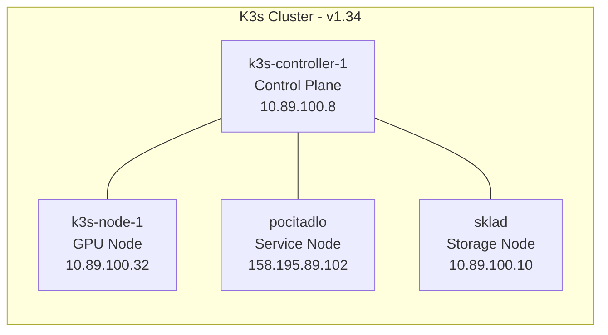
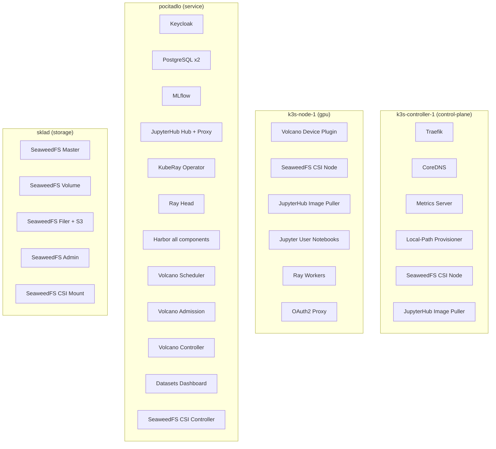

# Cluster Nodes

The K3s cluster consists of 4 nodes, each with a dedicated role. The cluster uses SQLite datastore (single server mode) with custom CIDRs.

## Node Architecture



## Node Details

| Node | Role | IP | OS | K3s Version | CPU | Memory |
|------|------|----|----|-------------|-----|--------|
| k3s-controller-1 | `control-plane` | 10.89.100.8 | Ubuntu 24.04.3 | v1.34.3 | 45m used | 2.2Gi / 27% |
| k3s-node-1 | `gpu` | 10.89.100.32 | Ubuntu 24.04.3 | v1.34.3 | 56m used | 1.2Gi / 5% |
| pocitadlo | `service` | 158.195.89.102 | Ubuntu 24.04.4 | v1.34.6 | 483m used | 7.3Gi / 2% |
| sklad | `storage` | 10.89.100.10 | Ubuntu 24.04.4 | v1.34.6 | 55m used | 1.4Gi / 18% |

## What Runs Where



## Node Labels

| Label | Applied To | Used By |
|-------|-----------|---------|
| `node-role.kubernetes.io/control-plane` | k3s-controller-1 | Traefik placement |
| `node-role.kubernetes.io/gpu` | k3s-node-1 | GPU workloads, Volcano device plugin |
| `node-role.kubernetes.io/service` | pocitadlo | Harbor, platform services |
| `node-role.kubernetes.io/storage` | sklad | SeaweedFS components |
| `gpu-node: "true"` | k3s-node-1 | Volcano device plugin DaemonSet |
| `sw-backend: "true"` | sklad | SeaweedFS master/filer |
| `sw-volume: "true"` | sklad | SeaweedFS volume server |

## Ansible Inventory

The cluster is provisioned via Ansible (`ansible-k3s-setup/fmfi-hosts.yml`):

```yaml
controller:
  hosts:
    master:
      ansible_host: fmfi-k3s-ctl
      ansible_user: ubuntu

node:
  hosts:
    worker1:
      ansible_host: fmfi-k3s-n1
      ansible_user: ubuntu
    k3s-node-2:
      ansible_host: pocitadlo
      ansible_user: filip
    sklad:
      ansible_host: sklad
      ansible_user: filip
      k3s_node_ip: 10.89.100.10
```
