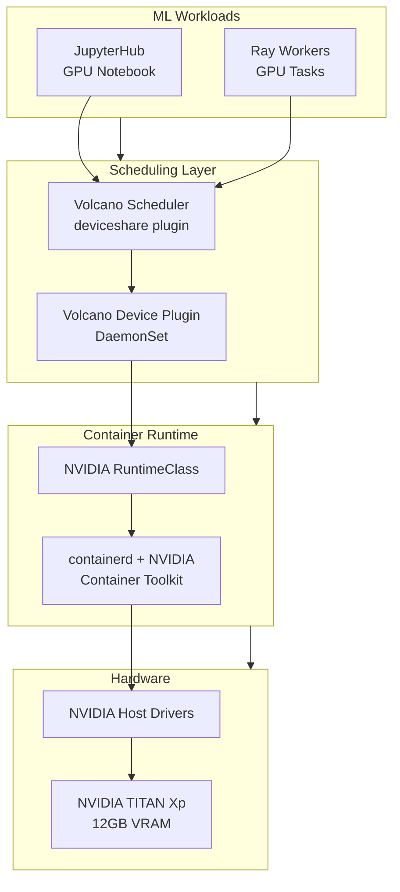
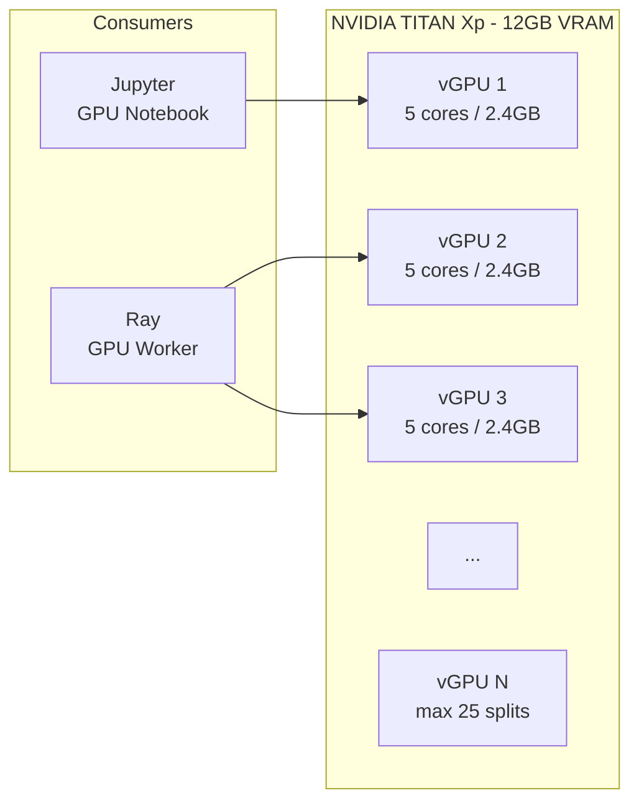
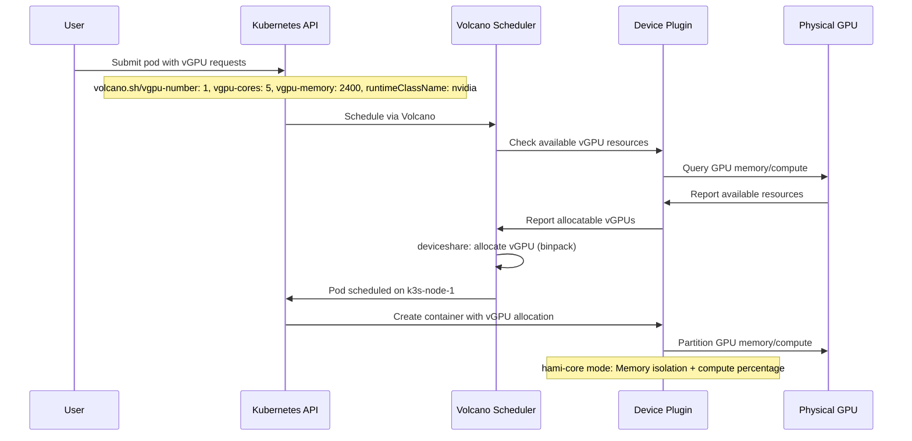

# GPU Stack

The cluster provides GPU acceleration through a layered stack: NVIDIA drivers, container runtime, Volcano device plugin, vGPU scheduling, and ML workloads. A single **NVIDIA TITAN Xp** (12GB VRAM) on `k3s-node-1` is shared among multiple concurrent users.

## GPU Stack Layers



## vGPU Architecture



## Scheduling Flow



## vGPU Resources

Custom resources used in pod specs:

| Resource | Unit | Description |
|----------|------|-------------|
| `volcano.sh/vgpu-number` | count | Number of vGPUs requested |
| `volcano.sh/vgpu-memory` | MB | VRAM allocation per vGPU |
| `volcano.sh/vgpu-cores` | percentage | Compute cores (out of 100) |
| `volcano.sh/vgpu-mode` | string | Operating mode (`hami-core`) |

## Current Configuration

| Parameter | Value |
|-----------|-------|
| Device split count | 25 (max vGPUs per GPU) |
| Device memory scaling | 1.0 |
| Operating mode | `hami-core` |
| Runtime class | `nvidia` |
| Device plugin image | `projecthami/volcano-vgpu-device-plugin:v1.11.0` |
| Volcano version | v1.13.1 |

## Scheduler Config

Volcano uses these scheduling plugins in order:

1. **enqueue** -- Queue management
2. **allocate** -- Main allocation (deviceshare for vGPU)
3. **backfill** -- Fill gaps with lower-priority jobs

The `deviceshare` plugin uses a **binpack** policy to pack vGPU workloads efficiently.

## Workload Examples

### JupyterHub GPU Profile
```yaml
resources:
  limits:
    volcano.sh/vgpu-number: 1
    volcano.sh/vgpu-cores: 5
    volcano.sh/vgpu-memory: 2400
  requests:
    volcano.sh/vgpu-number: 1
    volcano.sh/vgpu-cores: 5
    volcano.sh/vgpu-memory: 2400
schedulerName: volcano
runtimeClassName: nvidia
```

### Ray Worker GPU
```yaml
resources:
  limits:
    volcano.sh/vgpu-number: 1
    volcano.sh/vgpu-cores: 5
    volcano.sh/vgpu-memory: 2400
  requests:
    volcano.sh/vgpu-number: 1
    volcano.sh/vgpu-cores: 5
    volcano.sh/vgpu-memory: 2400
schedulerName: volcano
runtimeClassName: nvidia
```
