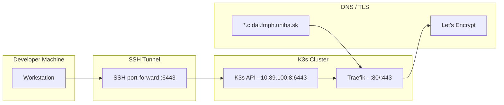
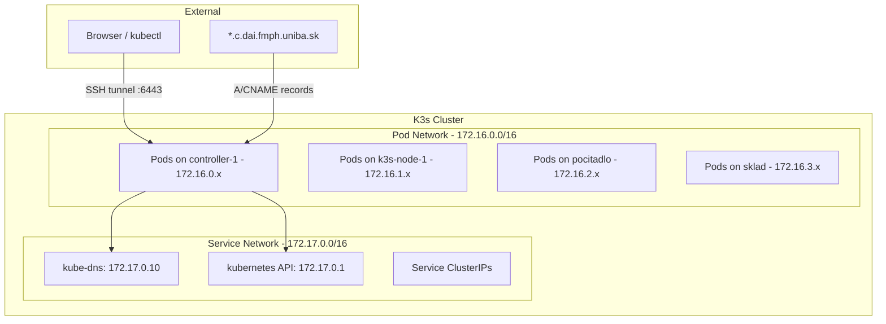

# Network Topology

## Access Path

Users connect to the cluster through SSH tunnels. There is no VPN; all remote access is via SSH port forwarding to the K3s API server.



## SSH Tunnel Setup

The `remote-kubectl.sh` helper script establishes an SSH tunnel for kubectl access:

```bash
ssh -fN -L 6443:127.0.0.1:6443 fmfi-k3s-ctl
```

The kubeconfig (`~/.kube/fmfi.yaml`) points to `localhost:6443`, which forwards to the K3s controller.

## Cluster Networking



## Network Details

| Network | CIDR | Purpose |
|---------|------|---------|
| Pod Network | `172.16.0.0/16` | Inter-pod communication (VXLAN overlay) |
| Service Network | `172.17.0.0/16` | ClusterIP services |
| Node Network | `10.89.100.0/24` | Physical node IPs (internal FMFI) |

## Firewall Rules (UFW)

| Port | Protocol | Purpose |
|------|----------|---------|
| 6443 | TCP | Kubernetes API server |
| 80 | TCP | HTTP (redirect to HTTPS) |
| 443 | TCP | HTTPS (Traefik entrypoint) |
| 10250 | TCP | Kubelet API |
| 8472 | UDP | VXLAN overlay network |
| 30000-32767 | TCP | NodePort range |
| 10001 | TCP | Ray Client (TCP IngressRoute) |

## Domain Routing

All services share the wildcard domain `*.c.dai.fmph.uniba.sk`. Traefik routes by Host header:

| Domain | Service |
|--------|---------|
| `auth.c.dai.fmph.uniba.sk` | Keycloak |
| `jhub.c.dai.fmph.uniba.sk` | JupyterHub |
| `mlflow.c.dai.fmph.uniba.sk` | MLflow |
| `ray.c.dai.fmph.uniba.sk` | Ray Dashboard |
| `ray-client.c.dai.fmph.uniba.sk` | Ray Client (TCP) |
| `harbor.c.dai.fmph.uniba.sk` | Harbor Registry |
| `storage.c.dai.fmph.uniba.sk` | SeaweedFS S3 API |
| `datasets.c.dai.fmph.uniba.sk` | Datasets Dashboard |
| `traefik.c.dai.fmph.uniba.sk` | Traefik Dashboard |
