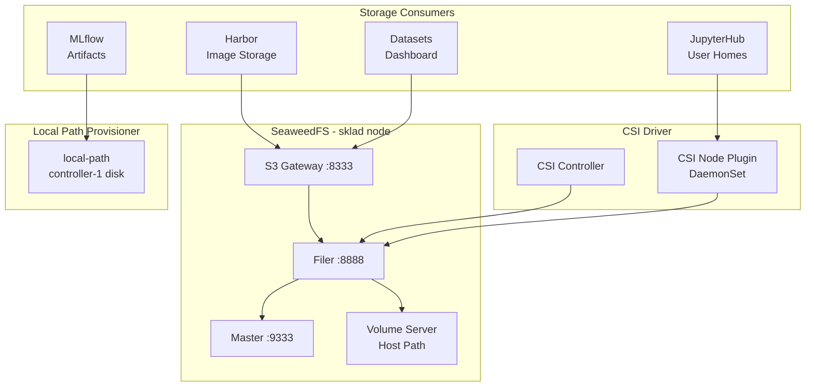
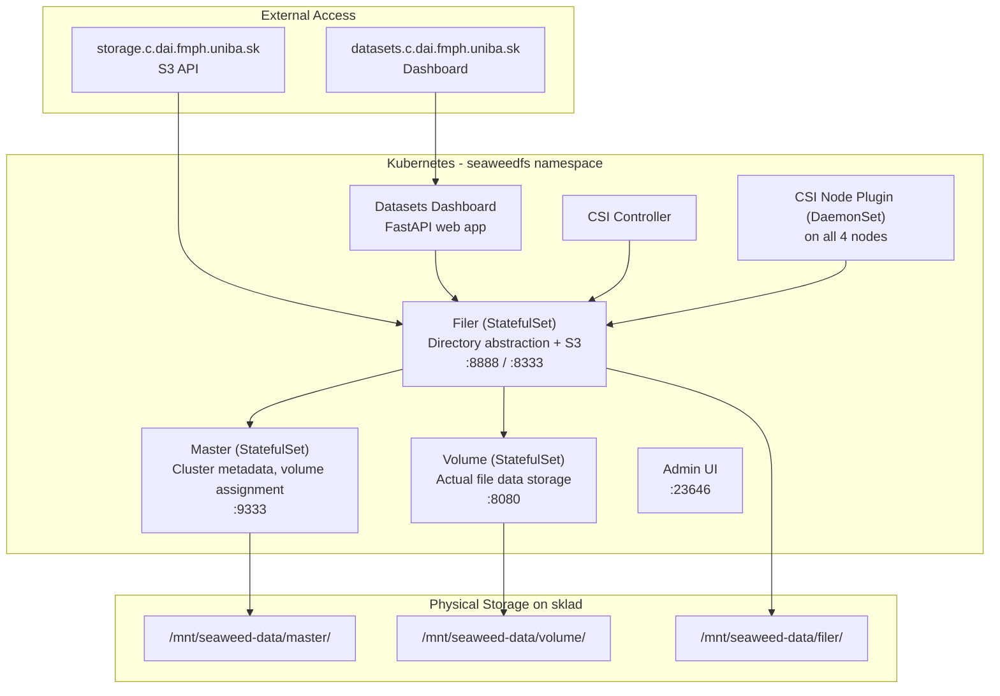

# Storage Architecture

Two storage backends serve the cluster: **SeaweedFS** for distributed/object storage and **local-path** for node-local persistent volumes.

## Storage Overview

## Storage Classes

| Class | Provisioner | Access | Binding | Expand | Use Case |
|-------|-------------|--------|---------|--------|----------|
| `local-path` (default) | rancher.io/local-path | RWO | WaitForFirstConsumer | No | DBs, internal state |
| `seaweedfs-storage` | seaweedfs-csi-driver | RWX | Immediate | Yes | User homes, shared data |

## SeaweedFS Architecture

## Persistent Volumes

| Claim | Namespace | Size | Class | Mode | Purpose |
|-------|-----------|------|-------|------|---------|
| `hub-db-dir` | jupyterhub | 1Gi | local-path | RWO | JupyterHub hub DB |
| `claim-fiil123` | jupyterhub | 10Gi | seaweedfs-storage | RWX | User home directory |
| `claim-fiil123--gpu` | jupyterhub | 10Gi | seaweedfs-storage | RWX | GPU notebook home |
| `claim-fiil123--gpu02` | jupyterhub | 10Gi | seaweedfs-storage | RWX | GPU notebook home 2 |
| `postgres-pvc` | keycloak | 10Gi | local-path | RWO | Keycloak PostgreSQL |
| `postgres-pvc` | mlflow | 10Gi | local-path | RWO | MLflow PostgreSQL |
| `mlflow-artifacts-pvc` | mlflow | 10Gi | local-path | RWO | MLflow artifact store |
| `database-data-harbor-database-0` | harbor | 2Gi | local-path | RWO | Harbor PostgreSQL |
| `data-harbor-redis-0` | harbor | 1Gi | local-path | RWO | Harbor Redis |
| `data-harbor-trivy-0` | harbor | 5Gi | local-path | RWO | Trivy vulnerability DB |
| `harbor-jobservice` | harbor | 1Gi | local-path | RWO | Harbor job logs |
| `traefik` | traefik-system | 128Mi | local-path | RWO | Let's Encrypt ACME certs |

## S3 Buckets

| Bucket | Purpose | Access |
|--------|---------|--------|
| `harbor-registry` | Harbor container image storage | Internal (Harbor to SeaweedFS) |
| `datasets` | Shared dataset storage | Per-user via dashboard |
| `datasets-<username>` | Per-user dataset bucket (20GB quota) | OIDC STS token exchange |
